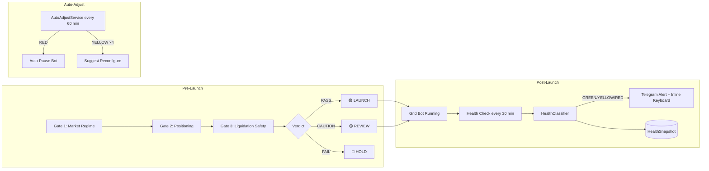
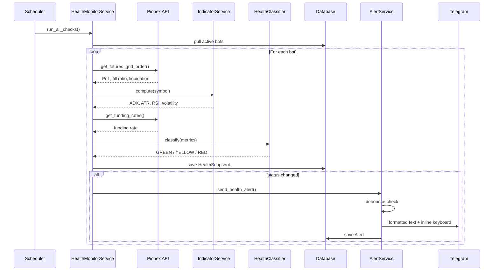
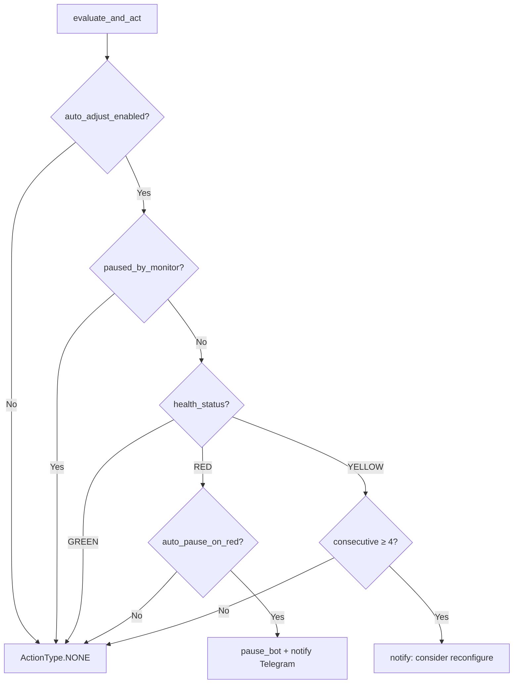

# Grid Bot Advisor and Monitor

A Telegram bot that answers two questions:

1. **Before launch:** *"Should I start the bot right now?"* — three independent risk gates → LAUNCH / REVIEW / HOLD verdict.
2. **After launch:** *"Is my running bot healthy?"* — real-time health monitoring → GREEN / YELLOW / RED with interactive management.

It pulls live data from the Pionex Futures API. No order is ever placed automatically — verdicts are advisory, and auto-corrective actions are opt-in (`auto_adjust_enabled=False` by default).



---

## Advisor: Pre-Launch Risk Gates

Before each potential launch the engine runs three gates in sequence. If any gate fails, subsequent gates are skipped.

### Gate 1 — Market Regime
Checks whether the market is range-bound rather than trending.

| Indicator | PASS | CAUTION | FAIL |
|---|---|---|---|
| ADX 14 | ≤ 25 | 25 – 30 | > 30 |
| Grid range vs ATR 14 | ≥ 3× ATR | — | < 3× ATR |
| Price vs 14d swing | inside range | outside range | — |
| Realized vol term structure | flat / falling | 1d < 7d < 30d | — |

### Gate 2 — Positioning
Checks that funding rates and open interest do not signal a crowded or high-risk setup.

| Indicator | PASS | CAUTION | FAIL |
|---|---|---|---|
| Funding rate annualized | < 20% | 20 – 40% | > 40% |
| OI 7d change | < 10% | 10 – 20% | > 20% |
| OI history | ≥ 7 days | < 7 days (CAUTION, not free pass) | — |

> Open interest is sampled daily and stored locally — Pionex provides only the current value, so history must be built up over time.

### Gate 3 — Liquidation Safety
Validates that the proposed grid parameters leave enough distance to the liquidation price. Calls Pionex's `checkParams` endpoint — no position is opened.

| Check | Result |
|---|---|
| Leverage > 5× | FAIL |
| Liquidation buffer < 2.5× grid range width (up or down) | FAIL |
| Stop-loss at or beyond liquidation price (LONG: SL ≤ liq; SHORT: SL ≥ liq) | FAIL |
| Stop-loss too close to price (< 1% for crypto, < 0.5% for XAUT) | CAUTION |
| Take-profit inside the grid range (LONG: TP < top; SHORT: TP > bottom) | CAUTION |
| Otherwise | PASS |

### Verdict

| Condition | Verdict |
|---|---|
| All gates PASS | 🟢 LAUNCH |
| No FAIL, at least one CAUTION | 🟡 REVIEW |
| Any gate FAIL | 🔴 HOLD |

## Monitor: Real-Time Bot Health

Once a grid bot is running, the system continuously monitors its health via scheduled checks.



### Health Status (GREEN / YELLOW / RED)

Six metrics are collected per bot per cycle, each scored individually:

| Metric | Weight | Source | GREEN | RED |
|---|---|---|---|---|
| Distance to liquidation | 35% | Pionex API | > 15% | < 7.5% |
| Unrealized PnL % | 20% | Pionex API | > –5% | < –15% |
| Grid fill ratio | 15% | Pionex API | < 70% | > 90% |
| ATR % of price | 15% | IndicatorService | < 5% | > 10% |
| Funding rate annualized | 10% | Pionex API | < 15% | > 30% |
| ADX(14) | 5% | IndicatorService | < 25 | > 35 |

The **worst** individual sub-status determines the overall status (RED > YELLOW > GREEN). A weighted `health_score` (0–1) is also computed.

Per-symbol overrides exist for XAUT (tighter volatility/fill thresholds), XRP, and SOL (wider ATR tolerance).

### Telegram Alerts

When status changes, a formatted alert is sent with:
- 🔄 Status transition (e.g. 🟢 GREEN → 🔴 RED)
- 🏥 Health score percentage
- 🚨 List of triggered alert types
- 📋 Detailed metric values

**Inline keyboard buttons vary by status:**

| Status | Buttons |
|---|---|
| 🟢 GREEN | `⏸️ Pause` `❌ Close` |
| 🟡 YELLOW | `⏸️ Pause` `🔄 Reconfigure` `❌ Close` `📊 Details` |
| 🔴 RED | `⏸️ Pause` `🔄 Reconfigure` `❌ Close` `📊 Details` `✅ Acknowledge` |

Alerts are **debounced**: the same alert type for the same bot won't re-fire within 5 minutes.

### Auto-Adjustments (opt-in)



| Condition | Action |
|---|---|
| RED + `auto_pause_on_red=True` | Bot auto-paused + notification sent |
| YELLOW for 4+ consecutive cycles | Notification: "consider reconfigure" (user confirms manually) |
| GREEN | No action |
| `auto_adjust_enabled=False` | **Everything disabled** (default) |

> ⚠️ Auto-reconfigure is **never** automatic — the system only suggests. The user confirms via Telegram callback.

### Snapshot Cleanup

Health snapshots older than 90 days are purged nightly at 03:00 UTC.

---

## Bot Commands

### Advisor

| Command | Description |
|---|---|
| `/start` | Introduction and overview |
| `/weekly_assessment` | Run a full three-gate assessment |
| `/daily_assessment` | Run Gate 2 (positioning) check |
| `/verdict` | Show the most recent stored verdict |
| `/help` | List available commands |

When a verdict suggests `LAUNCH`, an inline keyboard appears with 🪄 **Launch** (API) and 🦽 **Manual** (register without API).

### Monitor

| Command | Description |
|---|---|
| `/status` | Health summary of all active bots |
| `/status BTC_USDT_PERP` | Detailed health metrics for one bot |
| `/pause BTC_USDT_PERP` | Pause a bot (sets `paused_by_monitor`) |
| `/resume BTC_USDT_PERP` | Resume a paused bot |
| `/close BTC_USDT_PERP` | Close a bot via Pionex API |
| `/reconfigure BTC_USDT_PERP` | Re-run gates, propose new grid parameters |
| `/settings` | Show monitoring thresholds, intervals, flags |

---

## Scheduling

5 scheduled jobs:

| Job | Schedule | What it does |
|---|---|---|
| **Health check** | Every 30 min | Collect metrics, classify, alert on status change |
| **Auto adjust** | Every 60 min | Evaluate auto-pause / reconfigure suggestions |
| **Snapshot cleanup** | Daily 03:00 UTC | Delete snapshots older than 90 days |
| Daily positioning | Daily 00:05 UTC | Gate 2 only — store OI snapshot, alert if changed |
| Weekly assessment | Sat 09:00 UTC | Gates 1–3 — full verdict digest |

---

## Architecture

Clean Architecture — domain → application → infrastructure → presentation.

```
source/
├── domain/              # entities, value objects, exceptions
├── application/
│   ├── ports.py         # Notifier, MarketDataPort, GridPort
│   ├── services/        # HealthMonitor, HealthClassifier, AlertService,
│   │   │                # BotManagement, AutoAdjust, GridBuilder, Indicator
│   │   └── gates/       # 3 pre-launch risk gates (reused for reconfigure)
│   └── use_cases/       # pure rule functions for gates
├── infrastructure/
│   ├── http/pionex/     # API client, adapters, staleness guard
│   ├── database/        # SQLAlchemy models, alembic, repositories
│   └── telegram/        # AiogramNotifier, TelegramMessageFormatter
└── presentation/
    ├── bot/
    │   ├── handlers/    # advisor + monitor routers (10 commands total)
    │   └── keyboards/   # verdict reaction + health action keyboards
    └── scheduler/       # APScheduler: 5 cron/interval jobs
```

---

## Requirements

- Python ≥3.13
- PostgreSQL 16
- Pionex account with API key
- Telegram bot token and chat ID

---

## Configuration

All settings are read from environment variables (or a `.env` file).

| Variable | Description | Required |
|---|---|---|
| `TOKENT` | Telegram bot token | ✅ |
| `CHAT_ID` | Telegram chat ID | ✅ |
| `API_KEY` | Pionex API key | ✅ |
| `API_SECRET` | Pionex API secret | ✅ |
| `DB_HOST` / `DB_PORT` / `DB_USER` / `DB_PASSWORD` / `DB_NAME` | PostgreSQL connection | ✅ |
| `LOG_LEVEL` | `DEBUG`, `INFO`, `WARNING` (default: `DEBUG`) | — |
| `LOG_JSON` | Emit logs as JSON (default: `true`) | — |
| `MONITORING__INTERVALS__HEALTH_CHECK_MINUTES` | Health check interval | `30` |
| `MONITORING__INTERVALS__AUTO_ADJUST_MINUTES` | Auto-adjust interval | `60` |
| `MONITORING__INTERVALS__ALERT_DEBOUNCE_MINUTES` | Min gap between same alerts | `5` |
| `MONITORING__INTERVALS__METRICS_TTL_DAYS` | Snapshot retention | `90` |
| `MONITORING__AUTO_ADJUST_ENABLED` | Enable auto-actions | `false` |
| `MONITORING__AUTO_PAUSE_ON_RED` | Auto-pause on RED | `true` |
| `MONITORING__MAX_CONSECUTIVE_YELLOW_BEFORE_ACTION` | YELLOW cycles before alert | `4` |

Create a `.env` file:

```env
TOKENT=your_telegram_bot_token
CHAT_ID=your_chat_id
API_KEY=your_pionex_api_key
API_SECRET=your_pionex_api_secret
DB_HOST=localhost
DB_PORT=5432
DB_USER=postgres
DB_PASSWORD=your_db_password
DB_NAME=grid_advisor
```

---


## Testing

```bash
# Run all tests
uv run pytest

# Run only unit tests (~160 tests)
uv run pytest tests/unit/

# Run integration tests (DB)
uv run pytest tests/integration/

# Type checking + lint
uv run mypy
uv run ruff check . --fix
```

### Test structure

```
tests/
├── conftest.py              # shared fixtures (clock, settings, base entities)
├── fixtures/
│   ├── factories.py         # make_* factories for test data
│   ├── fakes.py             # shared fake repositories (in-memory, AbstractRepository)
│   └── pionex_responses/    # real API response fixtures (JSON)
├── unit/
│   ├── domain/              # entity validation, evaluate_checks, gate rules
│   ├── application/
│   │   ├── services/        # DecisionLogService, OISnapshotService, GridProposalBuilder, IndicatorService, GridBotService
│   │   ├── use_cases/
│   │   │   └── gates/       # market regime, positioning, liquidation safety rules (+ property-based)
│   │   └── formatters/      # alert, digest & health formatting
│   └── presentation/
│       └── bot/             # decision, launch & monitor handlers + keyboards
└── integration/
    ├── pionex/              # HTTP client + staleness guard adapter
    ├── persistence/         # decision_log, oi_snapshot & alert repositories
    └── test_full_assessment_pipeline.py  # end-to-end three-gate run
```

### Testing philosophy

- **Unit tests** follow the classical (Detroit) school: use real objects where possible, mock only external I/O (HTTP, DB). Hand-rolled fakes (`tests/fixtures/fakes.py`) replace real repositories — faster and more predictable than SQLite.
- **Property-based tests** (`test_property_based.py`) use Hypothesis to verify gate rules never crash on any valid input.
- **Gate rule tests** are parametrized to cover boundary values (ADX thresholds, funding rate thresholds) without duplicating test code.
- **Integration tests** use `respx` for HTTP mocking and SQLite `:memory:` for repository tests. Marked separately from unit tests.

---

## Local development

```bash
# Install dependencies
uv sync

# Apply database migrations
uv run alembic upgrade head

# Run the bot
uv run python -m source.main

# Run tests
uv run pytest

# Run tests with coverage
uv run pytest --cov --cov-report=term-missing

# Type checking
uv run mypy

# Lint + auto-fix
uv run ruff check . --fix
```

---

## Data persistence

| Table | Purpose |
|---|---|
| `oi_snapshots` | Daily OI samples — used to compute the 7-day change for Gate 2 |
| `decision_logs` | Full verdict history with gate results and raw values — audit trail |
| `grid_launches` | Launched grids — linked to verdicts, stores monitoring fields |
| `health_snapshots` | Per-cycle metrics (ADX, ATR, PnL, fill, funding, etc.) |
| `alerts` | Alert audit log — type, severity, message, acknowledged status |
